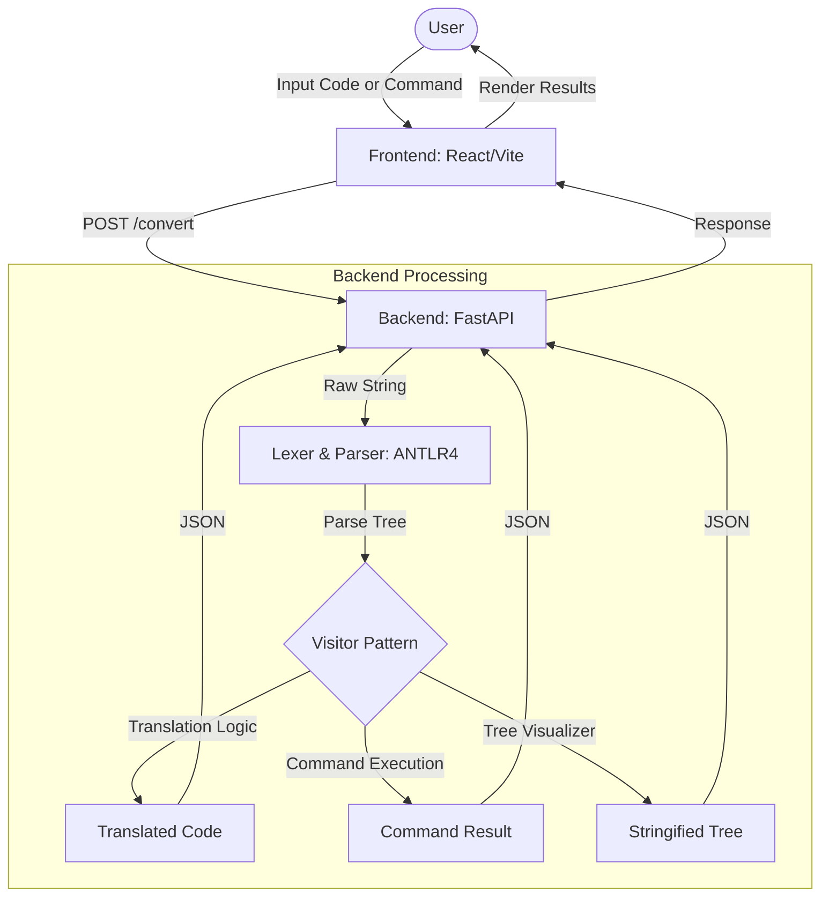

# Project Documentation: JavaPy-Translator

## 1. Project Name
**JavaPy-Translator**: A Bidirectional Code Translation Framework for Java and Python.

## 2. Member Contributions
*Note: Please update the names and specific contributions below as per your team structure.*

| Member Name | Key Contributions |
|-------------|-------------------|
| [Member 1]  | Team Leader & Backend Architect: Designed and implemented the FastAPI server, core API logic, and the code execution engine. |
| [Member 2]  | Frontend Developer: Designed and developed the React.js chat interface, state management, and conversation persistence. |
| [Member 3]  | Logic Implementer: Developed the translation visitor logic and type inference engine based on parsed trees. |
| [Member 4]  | Grammar Architect & Documentation: Designed the `py2java.g4`, `java2py.g4`, and `command.g4` grammars; handled operator precedence and project documentation. |

## 3. Problem Statement and System Description

### 3.1 Problem Statement
In modern software development, developers frequently switch between **Java** (robust, statically-typed, enterprise-ready) and **Python** (flexible, dynamically-typed, data-science oriented). Manual translation between these languages is:
- **Error-prone**: Subtle differences in syntax (e.g., semicolons, indentation) lead to bugs.
- **Time-consuming**: Translating large logic blocks manually wastes developer resources.
- **Cognitive Load**: Developers must remember deep semantic differences like Type Systems and Control Structures.

### 3.2 System Description
**JavaPy-Translator** is a bidirectional translation framework that solves these issues using formal language theory. The system features:
- **Bidirectional Translation**: Seamless conversion from Python to Java and Java to Python.
- **Chat-style Interface**: A modern UI where users can interact with the translator using code or natural language commands.
- **Command DSL**: Specialized commands like `show grammar` (to see the parse tree) or `show output` (to execute the code).
- **Persistence**: Remembers conversation context using local storage.

## 4. Framework and Workflow Visualization

The following diagram illustrates the data flow from user input to the final translated output.

## 5. Techniques for Each Component

### 5.1 Frontend (User Interface)
- **React.js**: Used for building a component-based, reactive UI.
- **Vite**: Modern build tool for fast development and bundling.
- **Tailwind CSS**: Utility-first CSS framework for responsive and themed (Light/Dark) styling.
- **LocalStorage API**: Persists chat history and user preferences directly in the browser.

### 5.2 Backend (Translation Engine)
- **FastAPI**: High-performance web framework for building APIs with Python.
- **ANTLR4**: Used to generate Lexers and Parsers from formal `.g4` grammar definitions.
- **Python 3**: The core language for implementing visitor logic and tree manipulation.
- **Subprocess Execution**: Used to run `javac` or `python` for the "show output" feature.

### 5.3 Translation Logic
- **Visitor Design Pattern**: Traverses the ANTLR-generated Parse Tree to perform source-to-source translation.
- **Type Inference Engine**: Automatically detects variable types in Python to generate valid Java declarations.

## 6. Application of Programming Language Principles (PPL)

### 6.1 Lexical Analysis (Lexer Syntax)
We defined comprehensive token sets for both languages to handle their unique lexical requirements:
- **Tokenization**: Converting raw characters into meaningful symbols (keywords, identifiers, literals).
- **Language-Specific Handling**:
    - **Python**: Implemented newline (`NL`) sensitivity to respect indentation-based scoping.
    - **Java**: Designed to skip whitespaces and newlines while focusing on brace-delimited blocks.

### 6.2 Syntax Analysis (Grammar Syntax)
We utilized **Context-Free Grammars (CFG)** to define the structural rules of both languages:
- **Expression Hierarchy**: Implemented strict operator precedence (Multiplication > Addition > Logic) using recursive grammar rules.
- **Left-Recursion Management**:
    - Used ANTLR's direct left-recursion support for Java expressions.
    - Utilized repetition operators (`*`, `+`) in Python grammars to ensure parsing efficiency.

### 6.3 Semantic Analysis and Translation
This phase bridges the gap between the two languages' semantics:
- **Type Inference**: Since Python is dynamically typed, our translator analyzes the right-hand side of assignments (e.g., `x = 5` becomes `int x = 5;` in Java).
- **Construct Mapping**:
    - Mapping Python's `range(n)` to Java's `for (int i=0; i<n; i++)`.
    - Mapping Java's `System.out.println()` to Python's `print()`.
- **Symbol Table Management**: Implicitly handled during tree traversal to ensure variables are declared before use in Java.

### 6.4 Intermediate Representation (Parse Trees)
The system generates a **Parse Tree** as an intermediate step. This tree serves as the source of truth for:
- **Translation**: Visitors extract data from nodes to build the target string.
- **Visualization**: The tree is stringified and displayed to the user for educational analysis of the code structure.
