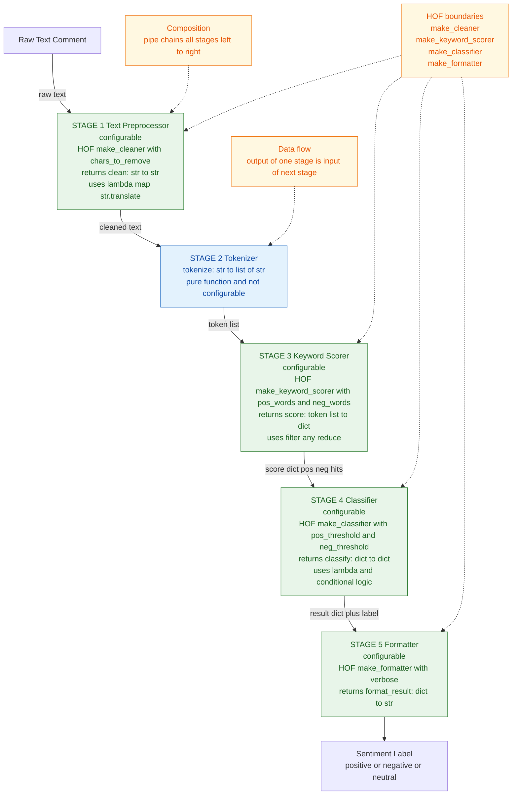
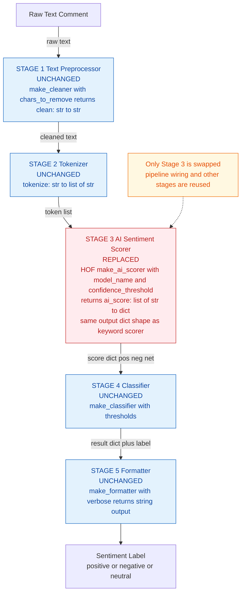

# Comment Filtering / Sentiment Analysis System
**PPL Spring 2026 — Lab 6: Higher-Order Functions**

---

## Part (a) — System Framework Diagram



---

## Part (b) — Implementation

The pipeline is assembled in `sentiment_pipeline.py` using four HOFs and a `pipe()` utility:

| HOF | Returns | HOF features used |
|---|---|---|
| `make_cleaner(chars)` | `clean : str → str` | `lambda`, `str.maketrans` |
| `make_keyword_scorer(pos, neg)` | `score : list → dict` | `filter`, `map`, `reduce`, `any` |
| `make_classifier(pos_t, neg_t)` | `classify : dict → dict` | closure over thresholds |
| `make_formatter(verbose)` | `fmt : dict → str` | closure over flag |

`pipe(*fns)` is itself built with `reduce`:

```python
pipe = lambda *fns: reduce(lambda f, g: lambda x: g(f(x)), fns)
analyze = pipe(clean, tokenize, score, classify, fmt)
```

---

## Part (c) — Explanation

**How the pipeline works**
`analyze(text)` threads the input through 5 functions sequentially. Each stage receives one value and returns one value; no stage knows about the others.

**Where function composition is used**
`pipe()` uses `reduce` to fold a list of functions into one combined function. Calling `analyze(text)` is exactly `fmt(classify(score(tokenize(clean(text)))))`.

**Where functions are passed as arguments or returned**
- `make_cleaner`, `make_keyword_scorer`, `make_classifier`, `make_formatter` all *return functions* — the core HOF pattern.
- `pipe()` *accepts functions as arguments* and returns a new composed function.
- `filter(lambda t: t in pos_words, tokens)` passes a lambda as an argument.
- `reduce(lambda f, g: lambda x: g(f(x)), fns)` passes and returns functions simultaneously.

**Why this is more flexible than a procedural design**
- Reconfiguring the pipeline requires only swapping one factory call. For example, `make_classifier(pos_threshold=2)` produces stricter classification with zero changes to other stages.
- Each stage is independently testable — `score(["great", "terrible"])` works without running the full pipeline.
- A procedural version would bury thresholds, keyword lists, and formatting as hardcoded values inside one monolithic function, making any change risky and spread across the codebase.

---

## Part (d) — AI Model Refactoring

### Refactored Framework Diagram


### What changed and what did not

| Stage | Status | Reason |
|---|---|---|
| Stage 1 — Cleaner | **Unchanged** | Text cleaning is model-agnostic |
| Stage 2 — Tokenizer | **Unchanged** | Tokenization is model-agnostic |
| Stage 3 — Scorer | **Replaced** | `make_ai_scorer` swaps in for `make_keyword_scorer` |
| Stage 4 — Classifier | **Unchanged** | Receives the same dict shape |
| Stage 5 — Formatter | **Unchanged** | Reads the same dict keys |

### How the HOF-based design supports this change

`make_ai_scorer` returns a function with an identical signature (`list[str] → dict`) and an identical output dict shape. The pipeline becomes:

```python
analyze_ai = pipe(clean, tokenize, ai_score, classify, fmt)
```

Only one slot changes. No other stage is aware that Stage 3's internals were replaced — this is the Open/Closed principle realised through higher-order functions. The boundary contract (input/output types) is all that matters, not the implementation behind it.
